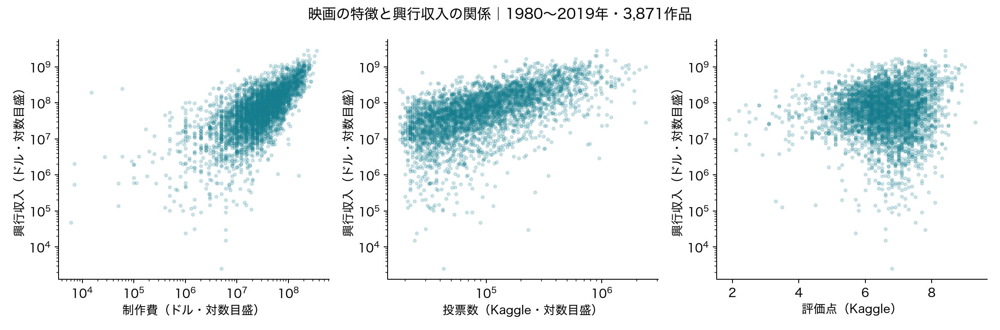
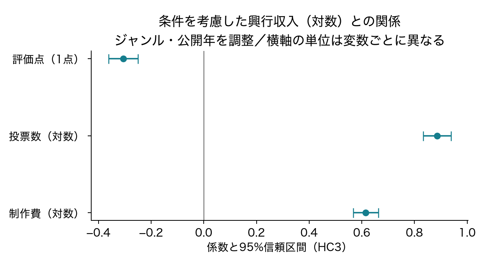
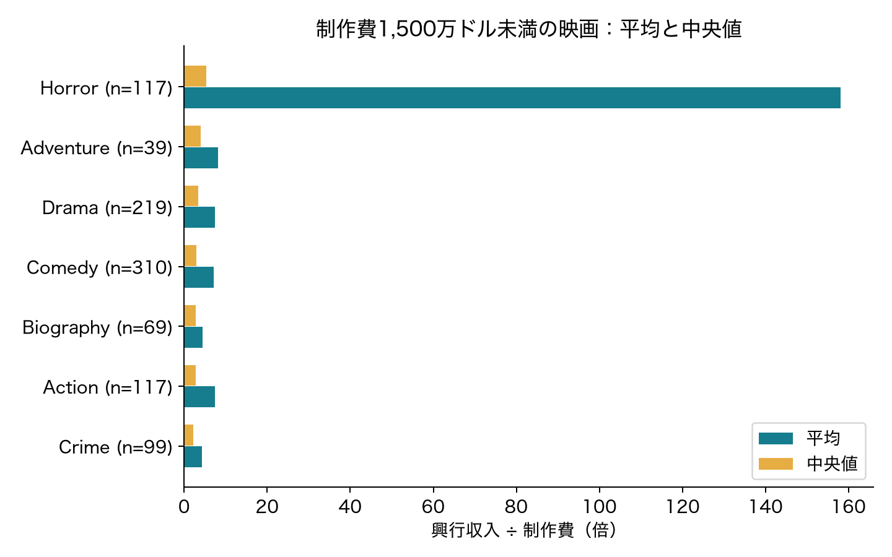

# 結果

## 条件を考慮した関連

図1：1点が1作品。制作費・投票数・興収の軸は対数目盛であり、同じ間隔が同じ倍率を表す。点の並びは関連であり因果を示さない。

| 主分析の説明変数 | 係数 | 95%信頼区間 |
|---|---:|---:|
| 制作費の対数 | 0.615 | 0.567〜0.663 |
| 投票数の対数 | 0.885 | 0.832〜0.938 |
| 評価点 | −0.306 | −0.362〜−0.249 |

主分析の決定係数は0.644である。これは使用した作品の対数興収の当てはまりであり、未知の映画を64.4%の確率で当てるという意味ではない。制作費・ジャンル・年だけのモデルでは0.477であったが、変数追加による標本内の改善を将来予測の精度とは解釈しない。

他の変数が同じというモデル上の条件で、制作費が1%大きい作品は興収が約0.615%、投票数が1%多い作品は興収が約0.885%大きい関係となる。これらは介入したときの効果ではない。評価点の負の係数も条件付きの関連であり、評価を下げる施策を支持しない。

図2：横線は95%信頼区間。評価点と対数変数では単位が違うため、係数の絶対値だけで重要度を順位づけない。

投票数を入れずに制作費・ジャンル・公開年と評価点を使った確認モデルでは、評価点の係数は正の0.251（95%信頼区間0.209〜0.292）であった。投票数を加えると負に変わるため、評価点の結論は条件の置き方に依存する。この確認モデルは符号の解釈を点検するために追加した分析である。

## ジャンル・公開時期

時期による制作費・投票数・評価点の傾きの差をまとめた検定のp値は0.0083であった。投票数の係数は2006年以前で0.826、2007年以降との差は0.141で、後期の係数は約0.966となる。一方、制作費と評価点の時期差はそれぞれの95%信頼区間に0を含む。したがって3指標がすべて同じように変化したとはいえない。

ジャンル別の投票数の傾きの差をまとめた検定のp値は0.00041であった。傾きが全ジャンルで同じという想定と整合しにくいが、モデルの決定係数は0.647で、主分析からの改善は小さい。個々のジャンル差は探索的な結果とし、多重比較や極端値の影響もあるため、特定のジャンルの優位性を断定しない。

## 低予算映画と極端値

制作費1,500万ドル未満の1,012作品について、興収／制作費倍率の平均は24.19倍、中央値は3.16倍であった。倍率上位2作品を除くと平均は7.38倍、倍率上位1%を除くと6.35倍となった。除外は都合のよい結果を選ぶためではなく、同じ集団の要約がどれだけ変わるかを見る感度分析である。

図3：低予算映画のうち30作品以上あるジャンルを表示。ホラー117作品の平均は158.16倍だが、中央値は5.33倍である。予算下位30%という別の定義を使った前期の集計とは対象が異なる。

## 主分析の確認

2020年の6作品を戻した場合の制作費・投票数・評価点の係数は、それぞれ0.614、0.886、−0.306であった。全体の倍率上位1%を除いた3,832作品では0.692、0.834、−0.273となった。主要3変数の符号はこの2つの変更では変わらなかった。ただし、これはすべての条件変更に対する頑健性を保証するものではない。

